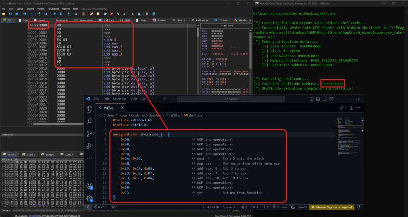

# Leveraging Windows Error Reporting (WER) for Stealthy Data Persistence & Evasion

This repository showcases a method that ingeniously exploits Windows Error Reporting (WER) for the purpose of stealthy data persistence and evasion. By embedding malicious payloads within WER reports, this technique allows for the covert maintenance of malicious code on a system, leveraging WER's local error report storage capabilities.

## Technique Overview

Windows Error Reporting (WER) is a feature of the Windows operating system that captures software crash reports and allows for them to be sent to Microsoft for analysis. This project takes advantage of WER's functionality to store these reports locally, providing a unique vector for persisting malicious payloads in a way that's less likely to be detected by traditional security measures.

The code within this repository demonstrates how to:
- Utilize the WerReportCreate API to generate fake error reports.
- Manipulate files within the `%ProgramData%\Microsoft\Windows\WER` directory.
- Embed and conceal malicious payloads within these reports, making them appear as legitimate error data to both the system and any scrutinizing eyes.

## Benefits

- Utilizes a trusted system component, reducing detection risk.
- Maintains the presence of payloads across system restarts without arousing suspicion.
- Circumvents standard security defenses by imitating benign system behavior.

## How It Works

The core of this technique involves creating a fake WER report with embedded shellcode. The process is as follows:
1. A fake error report is initiated using the WerReportCreate API.
2. Shellcode is appended to the content of this report, which is then saved in the designated WER directory.
3. The system treats this modified report as a legitimate WER file, overlooking the embedded malicious code during routine security checks.

This method effectively disguises the malicious payload within what appears to be normal system-generated data, exploiting the inherent trust placed in WER by the operating system and by extension, most security solutions.

## Disclaimer

This project is for educational and research purposes only. Any misuse of this information to conduct malicious activities is strictly prohibited.